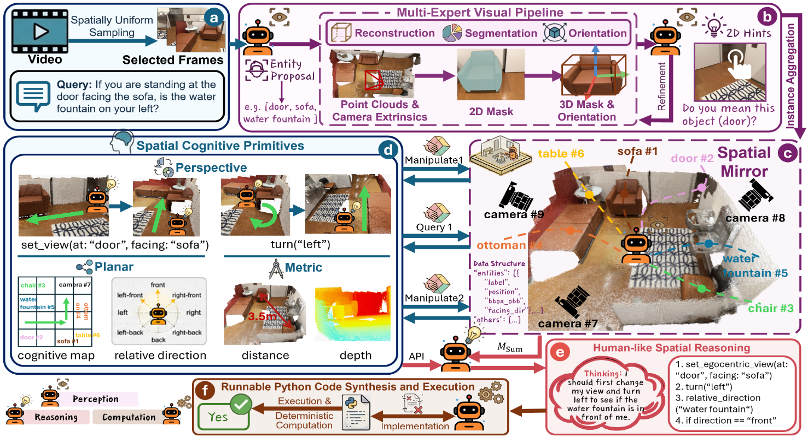
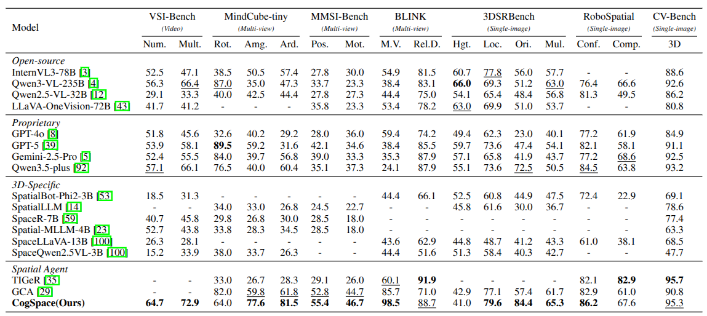

# CogSpace: Unleashing Spatial Intelligence in MLLMs via Decoupled Cognitive Agent

📖**[Paper](https://arxiv.org/abs/XXXX.XXXXX)**

CogSpace is a 3D spatial-reasoning agent framework for Multimodal Large Language Models (MLLMs). It deeply decouples three cognitive stages — **perception, reasoning, and computation** — so the language model focuses on high-level planning while a deterministic geometric engine handles the 3D math. The pipeline accepts a video scene + a spatial VQA question and outputs the predicted answer option.

---

## Method



The pipeline is implemented as a **LangGraph state machine** (`workflow/`). GPU-heavy stages run as isolated **Ray Serve** deployments sharing a single GPU. LLM calls go through a unified client factory (`llm_config.py`) that supports both cloud API (Alibaba DashScope / OpenAI-compatible) and a local **vLLM** server, switchable via `LLM_MODE`.

---

## Getting Started

### 1. Clone this repository and vendored subprojects

```bash
git clone https://github.com/<your-org>/CogSpace.git
cd CogSpace

# Pi3X — multi-view 3D reconstruction
git clone https://github.com/yyfz233/Pi3X.git pi3

# Orient-Anything-V2 — per-instance orientation estimation
# (vggt is already bundled inside, no separate clone needed)
git clone https://github.com/SpatialVision/Orient-Anything-V2.git Orient-Anything-V2-main
```

### 2. Install dependencies

```bash
conda create -n cogspace python=3.10 -y && conda activate cogspace

# Core package + Ray Serve + LangGraph (all declared in pyproject.toml)
pip install -e .
pip install -e ".[serve]"

# SAM3 requires the transformers dev branch (maybe not on PyPI)
pip install --force-reinstall "git+https://github.com/huggingface/transformers.git"
```

> For local vLLM inference add `pip install -e ".[vllm]"`.

### 3. Download model checkpoints

Place all weights under `ckpt/` in the project root:

| Model                        | Where to get it                                                                                   | Local path                     |
| ---------------------------- | ------------------------------------------------------------------------------------------------- | ------------------------------ |
| **SAM3** (gated)       | Request access at[facebook/sam3](https://huggingface.co/facebook/sam3), then download              | `ckpt/sam3/`                 |
| **Pi3X**               | [yyfz233/Pi3X](https://huggingface.co/yyfz233/Pi3X) — place manually                              | `ckpt/pi3x/`                 |
| **Orient-Anything-V2** | [Viglong/OriAnyV2_ckpt](https://huggingface.co/Viglong/OriAnyV2_ckpt) — place manually            | `ckpt/orianyv2/`             |
| **DINOv2**             | Auto-downloaded (backbone shared by Pi3X and OrientV2)                                            | HF cache                       |
| **Depth Anything V3**  | [LiheYoung/depth-anything-v3](https://huggingface.co/LiheYoung) — only needed for `query_depth` | set via`set_da3_model_dir()` |

### 4. Configure the LLM

Set the following environment variables before running:

```bash
# --- Cloud API (default, recommended) ---
export LLM_MODE=api
export DASHSCOPE_API_KEY=sk-your-key-here   # or OPENAI_API_KEY for OpenAI

# --- Local vLLM (optional) ---
# export LLM_MODE=local
# export VLLM_BASE_URL=http://127.0.0.1:8100/v1
# export VLLM_MODEL_NAME=Qwen/Qwen2.5-7B-Instruct   # must match what vLLM is serving
# export VLLM_MODEL_PATH=/path/to/your/model
```

The pipeline uses `qwen3.5-plus` in API mode by default. Override with `LLM_CHAT_MODEL`, `LLM_CODE_MODEL`, `LLM_VLM_MODEL`. In local mode every call uses the single model named by `VLLM_MODEL_NAME`.

### 5. Run

A bundled ARKitScenes test case (scene `41069025`, question id `957`) is pre-configured in `entrypoint/run_graph.py` with raw frames already under `raw_frames/`.

```bash
python START.py run
```

This single command starts a Ray head node, deploys all three vision models on Ray Serve, and runs the full LangGraph inference pipeline. For other operations (deploy-only, run-only, local LLM, stop), see `python START.py --help`.

---

## Main Results



---

## Citation

```bibtex
@article{cogspace2026,
  title   = {CogSpace: Unleashing Spatial Intelligence in MLLMs via Decoupled Cognitive Agent},
  author  = {},
  journal = {arXiv preprint arXiv:XXXX.XXXXX},
  year    = {2026}
}
```

---

## License

This project is released under the [MIT License](LICENSE). The vendored third-party code retains its original licenses.
